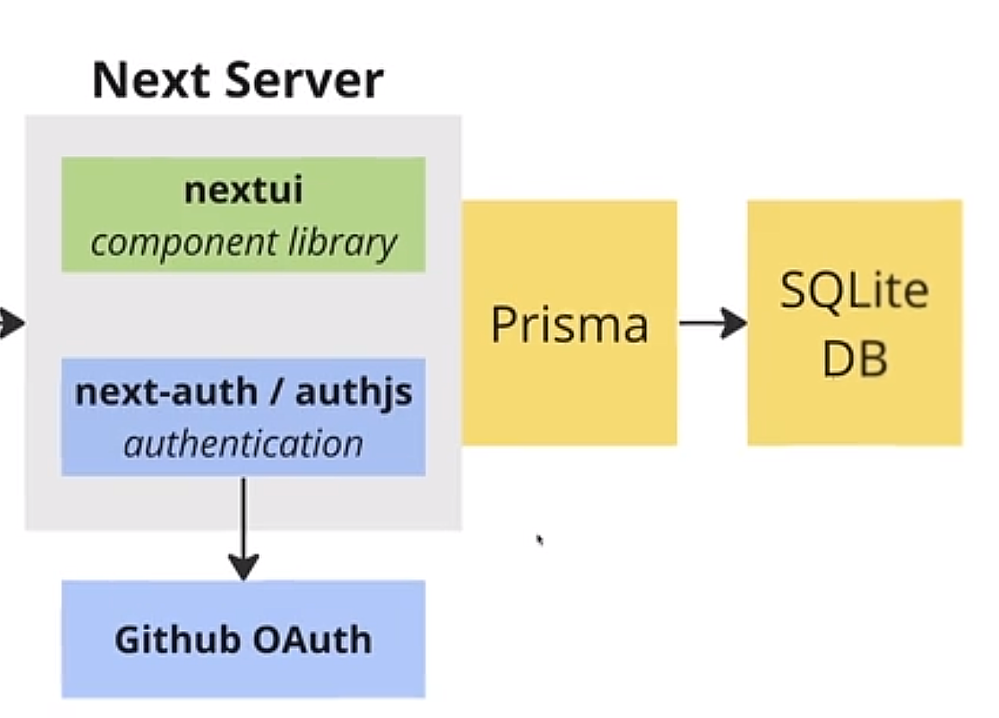
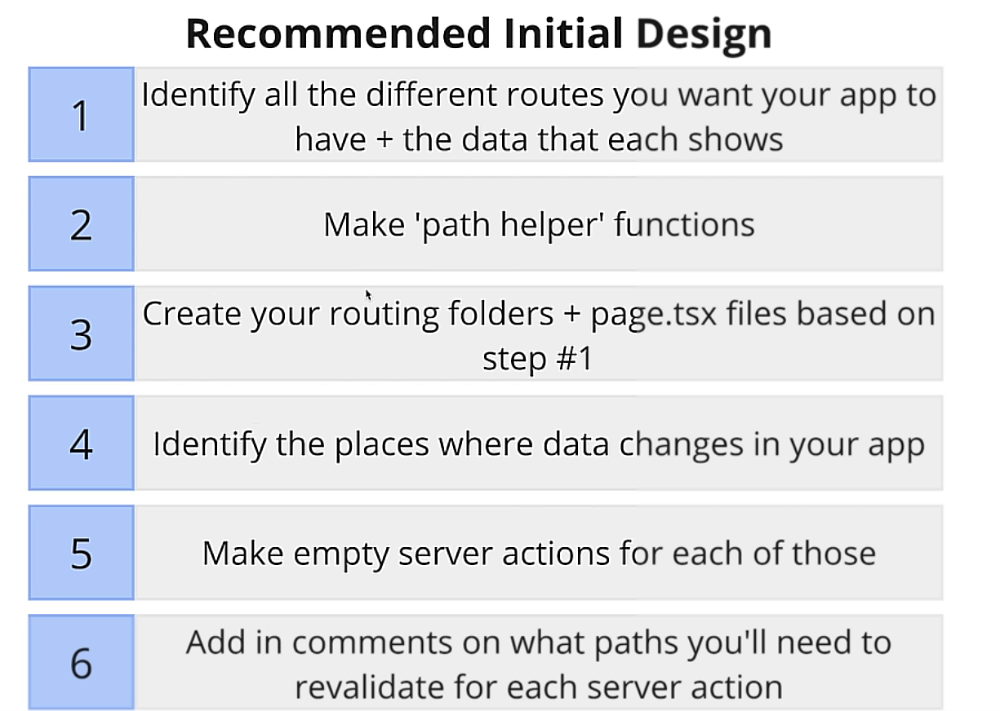
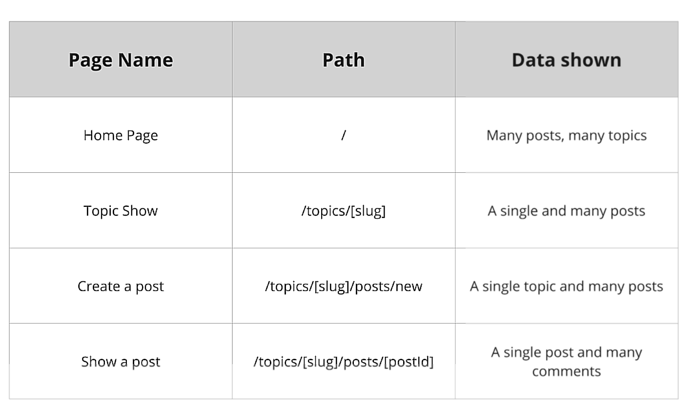
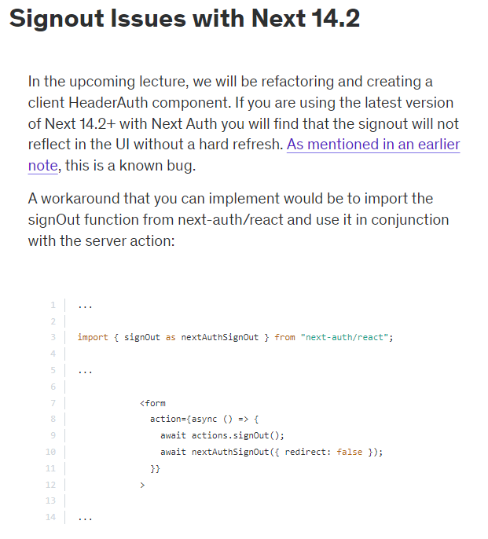
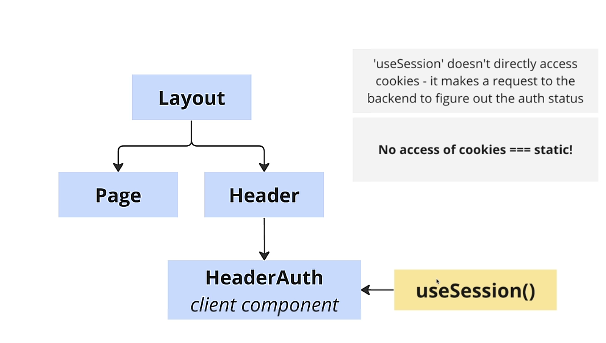
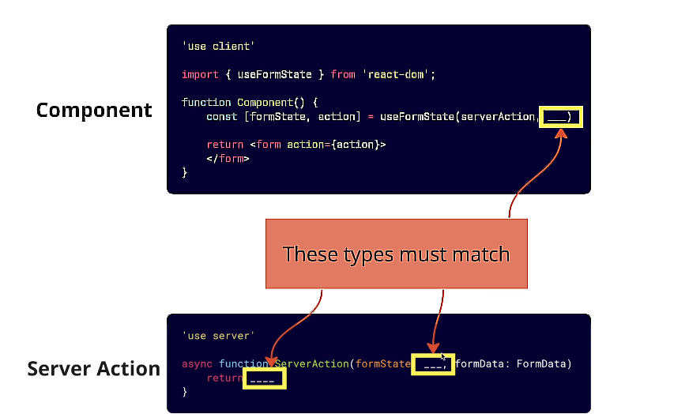

# redit-alternative-webapp

Going further on Next.js studies, this web app main objective is to be an alternative to the redit website.

## Stack

## Development and Design Best Practices

### Create a route information Table

## NextAuth Issues with Next 14.2

## Caching options with client component

## useFormState typing error

## Search feature

## Precious Software Design Tips

